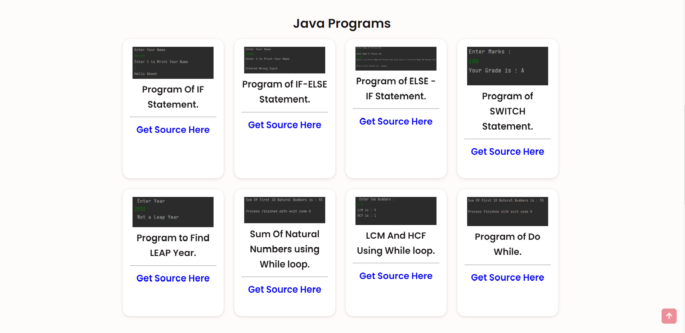

# Java
<h1>Class Programs For BCA (Java)</h1>
This GitHub Repository is based on OOP's based JAVA Programming with same basic college Programs.

<h3>Get Preview How to configure your Run configuration <a href="https://akashkinhaak.github.io/Java/config.html">Here</a></h3>

<h1>Get Preview For Source Files And Programs <a href="https://akashkinhaak.github.io/Java/">Here</a></h1>

<h3>Programs Below </h3>

<b>Program-01</b> Printing One Line Output : Preview <a href ="https://akashkinhaak.github.io/Java/#1"> Here</a>
 
<b>Program-02</b> Printing Two Line Output : Preview <a href ="https://akashkinhaak.github.io/Java/#2"> Here</a>
 
<b>Program-03</b> Taking String Input and Use in Text Lines Output : Preview <a href ="https://akashkinhaak.github.io/Java/#3"> Here</a>
 
<b>Program-04</b> Taking String (alphablet or number) as Input and Make A Pyramid Output : Preview <a href ="https://akashkinhaak.github.io/Java/#4"> Here</a>
 
<b>Program-05</b> Printing Pyramid and Triangle In Same Program (with two diff inputs) : Preview <a href ="https://akashkinhaak.github.io/Java/#5"> Here</a>
 
<b>Program-06</b> Multiplying A Number with 2   : Preview <a href ="https://akashkinhaak.github.io/Java/#6"> Here</a>
 
<b>Program-07</b> Program to Take Input With InputStreamReader   : Preview <a href ="https://akashkinhaak.github.io/Java/#7"> Here</a>
 
<b>Program-08</b> Program of SUM with InputStreamReader  : Preview <a href ="https://akashkinhaak.github.io/Java/#8"> Here</a>
 
<b>Program-09</b> Program Of IF Statement  : Preview <a href ="https://akashkinhaak.github.io/Java/#9"> Here</a>
 
<b>Program-10</b> Program of IF-ELSE Statement  : Preview <a href ="https://akashkinhaak.github.io/Java/#10"> Here</a>
 
<b>Program-11</b> Program of ELSE-IF Statement  : Preview <a href ="https://akashkinhaak.github.io/Java/#11"> Here</a>
 
<b>Program-12</b> Program of SWITCH Statement  : Preview <a href ="https://akashkinhaak.github.io/Java/#12"> Here</a>
 
<b>Program-13</b> Program to Find LEAP Year : Preview <a href ="https://akashkinhaak.github.io/Java/#13"> Here</a>
 
<b>Program-14</b> Sum Of Natural Numbers using While loop : Preview <a href ="https://akashkinhaak.github.io/Java/#14"> Here</a>
 
<b>Program-15</b> LCM And HCF Using While loop : Preview <a href ="https://akashkinhaak.github.io/Java/#15"> Here</a>
 
<b>Program-16</b> Program of Do While : Preview <a href ="https://akashkinhaak.github.io/Java/#16"> Here</a>
 
<b>Program-17</b> Program of palindrome using DO WHILE : Preview <a href ="https://akashkinhaak.github.io/Java/#17"> Here</a>
 
<b>Program-18</b> Sum of natural Numbers using FOR Loop : Preview <a href ="https://akashkinhaak.github.io/Java/#18"> Here</a>
 
<b>Program-19</b> Print Pyramid Using Loop Within Loop : Preview <a href ="https://akashkinhaak.github.io/Java/#19"> Here</a>
 
<b>Program-20</b> Nested LOOP Program. : Preview <a href ="https://akashkinhaak.github.io/Java/#20"> Here</a>

<!-- Array Started Below Here-->
<h2>Arrays Started </h2>

<b>Program-21</b> Basic Array Program. : Preview <a href ="https://akashkinhaak.github.io/Java/#21"> Here</a>
 
<b>Program-22</b> Array(With matrix) Program. : Preview <a href ="https://akashkinhaak.github.io/Java/#22"> Here</a>
 
<b>Program-23</b> Jagged Array Program. : Preview <a href ="https://akashkinhaak.github.io/Java/#23"> Here</a>
 
<b>Program-24</b> Use Of Class With Object Decleration Program. : Preview <a href ="https://akashkinhaak.github.io/Java/#24"> Here</a>
 
<b>Program-25</b> Declaring Object via Reference of Previous Object : Preview <a href ="https://akashkinhaak.github.io/Java/#25"> Here</a>

<!-- Parameters Started Below Here-->
<h2>Passing parameters </h2>

<b>Program-26</b> Passing Similar Paramater : Preview <a href ="https://akashkinhaak.github.io/Java/#26"> Here</a>
 
<b>Program-27</b> Passing Different Paramater : Preview <a href ="https://akashkinhaak.github.io/Java/#27"> Here</a>

<!-- Array Started Below Here-->
<h2>Constructers</h2>

<b>Program-C01/28</b> Default Constructor : Preview <a href ="https://akashkinhaak.github.io/Java/#c01"> Here</a>
 
<b>Program-C02/29</b> Parameterised Constructor : Preview <a href ="https://akashkinhaak.github.io/Java/#c02"> Here</a>
 
<b>Program-C03/30</b> Copy Constructor : Preview <a href ="https://akashkinhaak.github.io/Java/#c03"> Here</a>

<!-- Keywords Started Below Here-->
<h2>Keywords</h2>

<b>Program-K01/31</b> This Keyword : Preview <a href ="https://akashkinhaak.github.io/Java/#k01"> Here</a>
 
<b>Program-K02/32</b> Static Keyword : Preview <a href ="https://akashkinhaak.github.io/Java/#k02"> Here</a>
 
<b>Program-K03/33</b> Final Keyword : Preview <a href ="https://akashkinhaak.github.io/Java/#k03"> Here</a>

<!-- Interfaces Started Below Here-->
<h2>Interface programs</h2>

<b>Program-I01/34</b> Simple Interface : Preview <a href ="https://akashkinhaak.github.io/Java/#i01"> Here</a>
 
<b>Program-I02/35</b> Interface + Class : Preview <a href ="https://akashkinhaak.github.io/Java/#i02"> Here</a>
 
<b>Program-I03/36</b> Multiple Interface Inheritance : Preview <a href ="https://akashkinhaak.github.io/Java/#i03"> Here</a>

<!-- Interfaces Started Below Here-->
<h2>Inheritance programs</h2>

<b>Program-IN01/37</b> Simple Inheritance : Preview <a href ="https://akashkinhaak.github.io/Java/#in01"> Here</a>
 
<b>Program-IN02/38</b> Multi Level Inheritance : Preview <a href ="https://akashkinhaak.github.io/Java/#in02"> Here</a>
 
<b>Program-IN03/39</b> Hierarchial Inheritance : Preview <a href ="https://akashkinhaak.github.io/Java/#in03"> Here</a>

<!-- Abstraction Started Below Here-->
<h2>Abstraction Program</h2>

<b>Program-AB01/40</b> Simple Abstraction : Preview <a href ="https://akashkinhaak.github.io/Java/#abstract01"> Here</a>

<!-- Packages Started Below Here-->
<h2>Packages Programs</h2>

<b>Program-PKG01/41</b> Source Class : Preview <a href ="https://akashkinhaak.github.io/Java/#pkg01"> Here</a>
 
<b>Program-PKG02/42/b> Using Package.* : Preview <a href ="https://akashkinhaak.github.io/Java/#pkg02"> Here</a>
 
<b>Program-PKG03/43</b> Using Class Name : Preview <a href ="https://akashkinhaak.github.io/Java/#pkg03"> Here</a>
 
<b>Program-PKG04/44</b> Fully Qualified Nam : Preview <a href ="https://akashkinhaak.github.io/Java/#pkg04"> Here</a>

<!-- Exceptions Started Below Here-->
<h2>Exception programs</h2>

<b>Program-EX01/45</b> Arithmetic Exception : Preview <a href ="https://akashkinhaak.github.io/Java/#ex01"> Here</a>
 
<b>Program-EX02/46</b> Array Out Of Index Exception : Preview <a href ="https://akashkinhaak.github.io/Java/#ex02"> Here</a>
 
<b>Program-EX03/47</b> Exception Throw : Preview <a href ="https://akashkinhaak.github.io/Java/#ex03"> Here</a>

Thanks For Choosing Us
 

Follow Me Up Here : 

<a href= "https://www.youtube.com/channel/UC_8qig19f7fZ9LrAWYPATOQ" > Youtube </a>  
<a href= "https://t.me/akgames25 " >  Telegram </a>  
<a href= "https://twitter.com/akashkinha01 " >  Twitter </a>   
<a href= "https://github.com/akashkinhaak " >   Github </a>   

